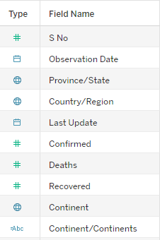
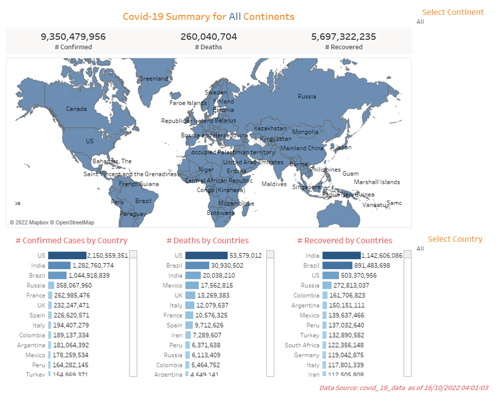

<h1 align="center">Covid 19 Dashboard Using Tableau</h1>
<h4 align="center">16-10-2022</h4> 

<h3>Task</h3> 

The purpose of this visualization is to:

<ol>
  <li>practice with the Tableau Business Intelligence Tool;</li>
  <li>be proficient in Tableau.</li>
</ol>
<h3>Data Sources</h3> 

The Covid-19 data set is gotten form the World Health Organization (WHO) website. 

  
The fields of the dataset are as follows:
 
   

<h3>Data Visualization Tool</h3>

Tableau was the  business intelligence software used.
 

<h3>Data Visualization Process</h3>

The following steps were taken in Tableau:
 
<ol>
   <li>Data types for each field is aligned to its data. For example, the various date fields is changed from strings to date datatype.</li>
   <li>A map that shows all countries is created.</li>
   <li>Bar charts showing numbers of confirmed cases, recoveries and deaths due to Covid-19 is created seperately.</li>
   <li>Filters are applied to both the maps and the bar charts. This enabled selection of one or more countries to be displayed on the dashboard.</li>
   <li>The numbers of confirmed cases, recoveries and deaths are displayed in tabular format.</li>
   <li>A dashboard is created which brings all the aforementioned features together.</li>
</ol>
<h3>Dashboard</h3>

    

 
<h4 align="center">Download the Covid-19 Dataset <a href="https://github.com/shittuadams/Covid-19-Dashboard/blob/main/covid_19_data.xlsx" target="_blank">here</a>.</h4>
